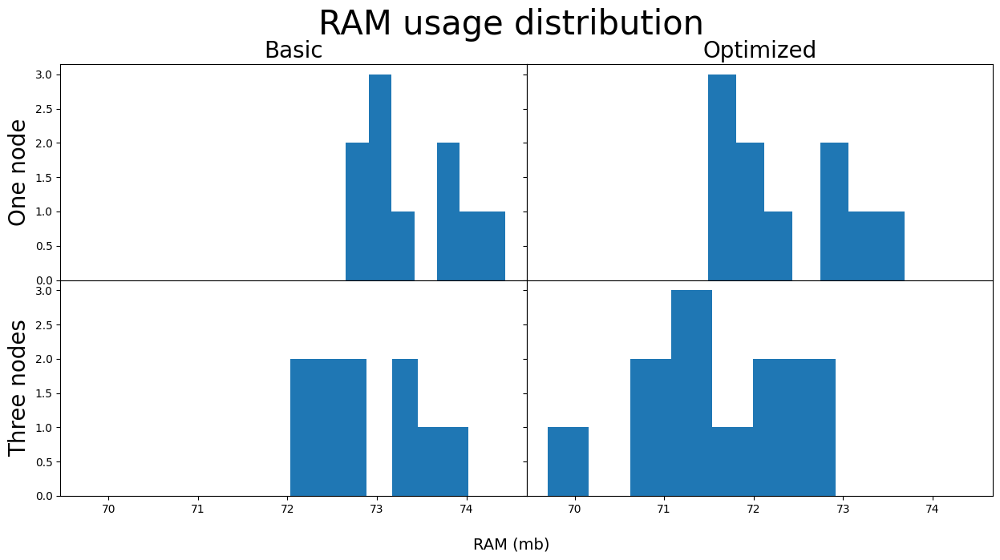
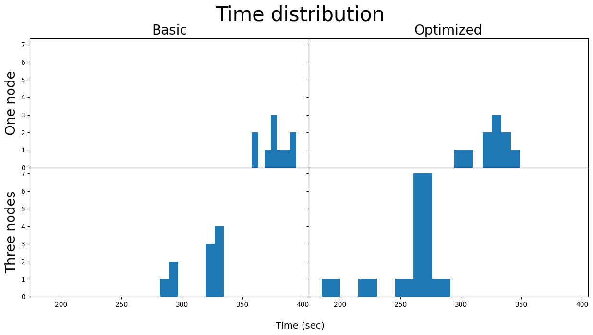

# Prerequisites

```
python --version
>> Python 3.10.12
```

```bash
docker version
>> Version:           26.0.0
>> API version:       1.45
>> Go version:        go1.21.8
>> Git commit:        2ae903e
>> Built:             Wed Mar 20 15:17:48 2024
>> OS/Arch:           linux/amd64
>> Context:           default
```

```
docker compose version
>> Docker Compose version v2.25.0
```

```
lsb_release -a
>> Distributor ID: Ubuntu
>> Description:    Ubuntu 22.04.4 LTS
>> Release:        22.04
>> Codename:       jammy
```


# Run application

```
cd .deploy
```

1. Build image

```
docker compose build
```

2. Run container

```
# one worker, one datanode
docker compose up -d
# three workers, one datanode
docker compose up -d --scale spark-yarn-worker=3
# one worker, three datanode
docker compose up -d --scale datanode=3
```

3. Start application


```
hdfs dfs -put /mnt/data/usa_real_estate.csv /hadoop_data/usa_real_estate.csv
```


```
docker exec da-spark-yarn-master spark-submit --master yarn --deploy-mode cluster ./apps/client.py --log-prefix 1node_optimal --optimized 
```

4. Close container

```
docker compose down
```

# Results



